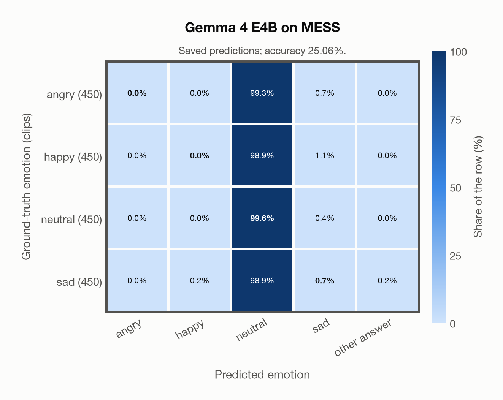

# Gemma 4 E4B on MESS

Regenerated offline from saved CSV/JSON by `scripts/evaluation/refresh_reports.py`. This refresh performs no model inference or API requests.

## Summary

| Metric | Recomputed value |
|---|---:|
| Clips | 1,800 |
| Accuracy: acted emotion | 25.06% |
| UAR: mean ground-truth-row recall | 25.06% |
| Macro F1 | 10.35% |
| Weighted F1: true-support weighted | 10.35% |
| Accuracy: all model classes | 25.06% |
| Invalid / outside-candidate answers | 1 (0.06%) |

## Imported run and verification

- Source: [prediction CSV](../../outputs/gemma4_e4b/mess_predictions.csv) and [metadata JSON](../../outputs/gemma4_e4b/mess_predictions.json); both remain byte-for-byte unchanged.
- Original execution date recorded in JSON: `2026-11-13`.
- Dataset scope recorded in JSON: **MESS**, English; 1,800 / 1,800 clips.
- Ground-truth column: `acted_emotion`. Candidate classes: angry, happy, neutral, sad.
- Row counts, unique audio paths, correctness flags and saved metrics were checked against the CSV. Metric agreement tolerance is 0.000001 (six-decimal metadata).
- Weighted F1 weights each class's F1 by its true support, using the same resolved truth as macro F1; invalid answers remain errors. New metrics absent from the source JSON are recorded in the offline audit and summaries; the source JSON is preserved.
- Saved candidate/prompt/model protocol matches current configuration: scope `dataset`, model `google/gemma-4-E4B-it`, prompt hash `e683d765d4ac`.
- Original execution/client runtime metadata (reported by the imported run, not measured by this refresh): `{"device": "cuda:0", "hardware": "NVIDIA L4", "seconds": 2515.7, "ms_per_clip": 1397.6, "on_cpu": 0}`.
- Saved p_* columns encode the returned answer as one-hot values; they are not calibrated API class probabilities, and no confidence plot is inferred from them.
- A raw responses journal is present; this refresh validates CSV/JSON only.

## Prediction distribution

Counts and shares use all saved samples. The invalid bucket combines `invalid` and `other answer`: answers outside the dataset's candidate classes remain errors.

| Predicted label | Clips | Share of all clips |
|---|---:|---:|
| angry | 0 | 0.00% |
| happy | 1 | 0.06% |
| neutral | 1,785 | 99.17% |
| sad | 13 | 0.72% |
| invalid / outside candidates | 1 | 0.06% |

## Results per emotion

| Ground-truth emotion | Clips | Recall | Acted-or-listener recall |
|---|---:|---:|---:|
| angry | 450 | 0.00% | — |
| happy | 450 | 0.00% | — |
| neutral | 450 | 99.56% | — |
| sad | 450 | 0.67% | — |

Precision/F1 use the same resolved-truth convention as the evaluation script. Weighted F1 uses the resolved-truth clip counts below as weights.

| Predicted emotion | Resolved-truth clips | Precision | Recall | F1 |
|---|---:|---:|---:|---:|
| angry | 450 | 0.00% | 0.00% | 0.00% |
| happy | 450 | 0.00% | 0.00% | 0.00% |
| neutral | 450 | 25.10% | 99.56% | 40.09% |
| sad | 450 | 23.08% | 0.67% | 1.30% |

## Confusion matrix: acted emotion

| Ground truth \ Predicted | angry | happy | neutral | sad | other answer |
|---|---|---|---|---|---|
| angry (450) | **0.0%** | 0.0% | 99.3% | 0.7% | 0.0% |
| happy (450) | 0.0% | **0.0%** | 98.9% | 1.1% | 0.0% |
| neutral (450) | 0.0% | 0.0% | **99.6%** | 0.4% | 0.0% |
| sad (450) | 0.0% | 0.2% | 98.9% | **0.7%** | 0.2% |

## Caveats

- **Training involvement for Gemma 4 E4B: No corpus-specific evidence**. Source: Broad multimodal pretraining and instruction tuning; complete corpus-level provenance not published (Google). Direct use and upstream teacher use both count as training involvement. No pattern: no corpus-specific evidence, not verified unseen. Corpus use is not test-clip leakage.
- Internal CSV/JSON consistency does not authenticate the original model or remote request logs.

[Offline validation audit](mess_offline_audit.json)
