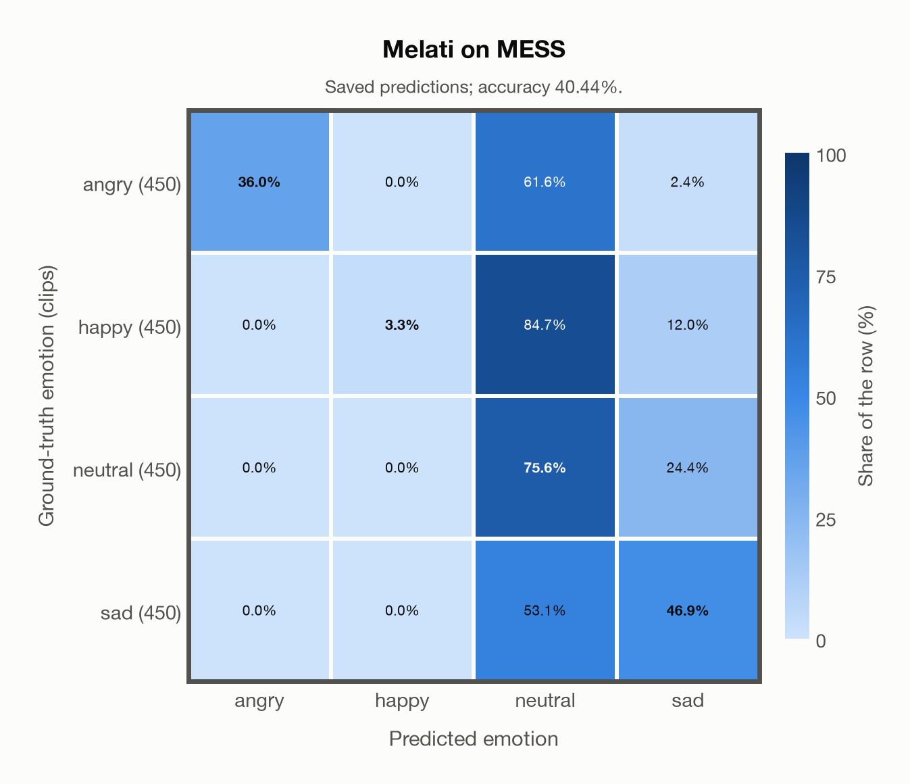

# Melati on MESS

Regenerated offline from saved CSV/JSON by `scripts/evaluation/refresh_reports.py`. This refresh performs no model inference or API requests.

## Summary

| Metric | Recomputed value |
|---|---:|
| Clips | 1,800 |
| Accuracy: acted emotion | 40.44% |
| UAR: mean ground-truth-row recall | 40.44% |
| Macro F1 | 37.54% |
| Weighted F1: true-support weighted | 37.54% |
| Accuracy: all model classes | 40.06% |

## Imported run and verification

- Source: [prediction CSV](../../outputs/melati_emotion/mess_predictions.csv) and [metadata JSON](../../outputs/melati_emotion/mess_predictions.json); both remain byte-for-byte unchanged.
- Original execution date recorded in JSON: `2026-10-29`.
- Dataset scope recorded in JSON: **MESS**, English; 1,800 / 1,800 clips.
- Ground-truth column: `acted_emotion`. Candidate classes: angry, happy, neutral, sad.
- Row counts, unique audio paths, correctness flags and saved metrics were checked against the CSV. Metric agreement tolerance is 0.000001 (six-decimal metadata).
- Weighted F1 weights each class's F1 by its true support, using the same resolved truth as macro F1; invalid answers remain errors. New metrics absent from the source JSON are recorded in the offline audit and summaries; the source JSON is preserved.
- Original execution/client runtime metadata (reported by the imported run, not measured by this refresh): `{"device": "mps", "hardware": "Apple M4 Max", "seconds": 674.1, "ms_per_clip": 374.5, "on_cpu": 0}`.

## Results per emotion

| Ground-truth emotion | Clips | Recall | Acted-or-listener recall |
|---|---:|---:|---:|
| angry | 450 | 36.00% | — |
| happy | 450 | 3.33% | — |
| neutral | 450 | 75.56% | — |
| sad | 450 | 46.89% | — |

Precision/F1 use the same resolved-truth convention as the evaluation script. Weighted F1 uses the resolved-truth clip counts below as weights.

| Predicted emotion | Resolved-truth clips | Precision | Recall | F1 |
|---|---:|---:|---:|---:|
| angry | 450 | 100.00% | 36.00% | 52.94% |
| happy | 450 | 100.00% | 3.33% | 6.45% |
| neutral | 450 | 27.49% | 75.56% | 40.31% |
| sad | 450 | 54.66% | 46.89% | 50.48% |

## Confusion matrix: acted emotion

| Ground truth \ Predicted | angry | happy | neutral | sad |
|---|---|---|---|---|
| angry (450) | **36.0%** | 0.0% | 61.6% | 2.4% |
| happy (450) | 0.0% | **3.3%** | 84.7% | 12.0% |
| neutral (450) | 0.0% | 0.0% | **75.6%** | 24.4% |
| sad (450) | 0.0% | 0.0% | 53.1% | **46.9%** |

## Caveats

- **Training involvement for Melati: No corpus-specific evidence**. Source: Public SER head trained on nine named corpora including JL-Corpus and Emozionalmente; Whisper-v3 pretraining incompletely disclosed; author nEMO threshold calibration is counted as seen development use, although its thresholds are not applied here. Direct use and upstream teacher use both count as training involvement. No pattern: no corpus-specific evidence, not verified unseen. Corpus use is not test-clip leakage.
- Internal CSV/JSON consistency does not authenticate the original model or remote request logs.

[Offline validation audit](mess_offline_audit.json)
