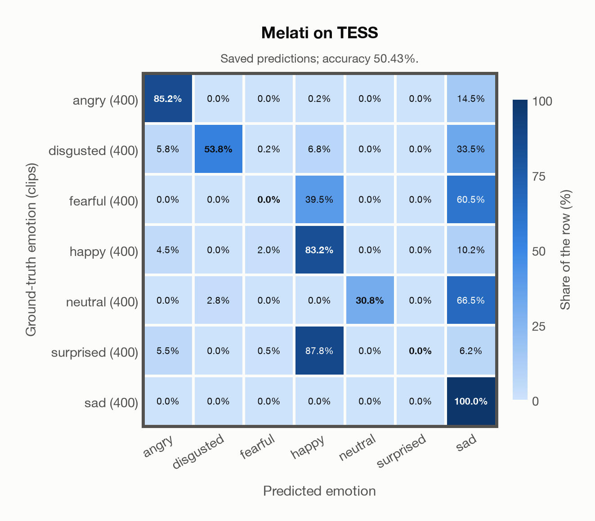

# Melati on TESS

Regenerated offline from saved CSV/JSON by `scripts/evaluation/refresh_reports.py`. This refresh performs no model inference or API requests.

## Summary

| Metric | Recomputed value |
|---|---:|
| Clips | 2,800 |
| Accuracy: acted emotion | 50.43% |
| UAR: mean ground-truth-row recall | 50.43% |
| Macro F1 | 43.44% |
| Weighted F1: true-support weighted | 43.44% |
| Accuracy: all model classes | 50.43% |

## Imported run and verification

- Source: [prediction CSV](../../outputs/melati_emotion/tess_predictions.csv) and [metadata JSON](../../outputs/melati_emotion/tess_predictions.json); both remain byte-for-byte unchanged.
- Original execution date recorded in JSON: `2026-10-29`.
- Dataset scope recorded in JSON: **TESS**, English; 2,800 / 2,800 clips.
- Ground-truth column: `acted_emotion`. Candidate classes: angry, disgusted, fearful, happy, neutral, surprised, sad.
- Row counts, unique audio paths, correctness flags and saved metrics were checked against the CSV. Metric agreement tolerance is 0.000001 (six-decimal metadata).
- Weighted F1 weights each class's F1 by its true support, using the same resolved truth as macro F1; invalid answers remain errors. New metrics absent from the source JSON are recorded in the offline audit and summaries; the source JSON is preserved.
- Original execution/client runtime metadata (reported by the imported run, not measured by this refresh): `{"device": "mps", "hardware": "Apple M4 Max", "seconds": 1052.7, "ms_per_clip": 376.0, "on_cpu": 0}`.

## Results per emotion

| Ground-truth emotion | Clips | Recall | Acted-or-listener recall |
|---|---:|---:|---:|
| angry | 400 | 85.25% | — |
| disgusted | 400 | 53.75% | — |
| fearful | 400 | 0.00% | — |
| happy | 400 | 83.25% | — |
| neutral | 400 | 30.75% | — |
| surprised | 400 | 0.00% | — |
| sad | 400 | 100.00% | — |

Precision/F1 use the same resolved-truth convention as the evaluation script. Weighted F1 uses the resolved-truth clip counts below as weights.

| Predicted emotion | Resolved-truth clips | Precision | Recall | F1 |
|---|---:|---:|---:|---:|
| angry | 400 | 84.41% | 85.25% | 84.83% |
| disgusted | 400 | 95.13% | 53.75% | 68.69% |
| fearful | 400 | 0.00% | 0.00% | 0.00% |
| happy | 400 | 38.28% | 83.25% | 52.44% |
| neutral | 400 | 100.00% | 30.75% | 47.04% |
| surprised | 400 | 0.00% | 0.00% | 0.00% |
| sad | 400 | 34.31% | 100.00% | 51.09% |

## Confusion matrix: acted emotion

| Ground truth \ Predicted | angry | disgusted | fearful | happy | neutral | surprised | sad |
|---|---|---|---|---|---|---|---|
| angry (400) | **85.2%** | 0.0% | 0.0% | 0.2% | 0.0% | 0.0% | 14.5% |
| disgusted (400) | 5.8% | **53.8%** | 0.2% | 6.8% | 0.0% | 0.0% | 33.5% |
| fearful (400) | 0.0% | 0.0% | **0.0%** | 39.5% | 0.0% | 0.0% | 60.5% |
| happy (400) | 4.5% | 0.0% | 2.0% | **83.2%** | 0.0% | 0.0% | 10.2% |
| neutral (400) | 0.0% | 2.8% | 0.0% | 0.0% | **30.8%** | 0.0% | 66.5% |
| surprised (400) | 5.5% | 0.0% | 0.5% | 87.8% | 0.0% | **0.0%** | 6.2% |
| sad (400) | 0.0% | 0.0% | 0.0% | 0.0% | 0.0% | 0.0% | **100.0%** |

## Caveats

- **Training involvement for Melati: No corpus-specific evidence**. Source: Public SER head trained on nine named corpora including JL-Corpus and Emozionalmente; Whisper-v3 pretraining incompletely disclosed; author nEMO threshold calibration is counted as seen development use, although its thresholds are not applied here. Direct use and upstream teacher use both count as training involvement. No pattern: no corpus-specific evidence, not verified unseen. Corpus use is not test-clip leakage.
- Internal CSV/JSON consistency does not authenticate the original model or remote request logs.

[Offline validation audit](tess_offline_audit.json)
